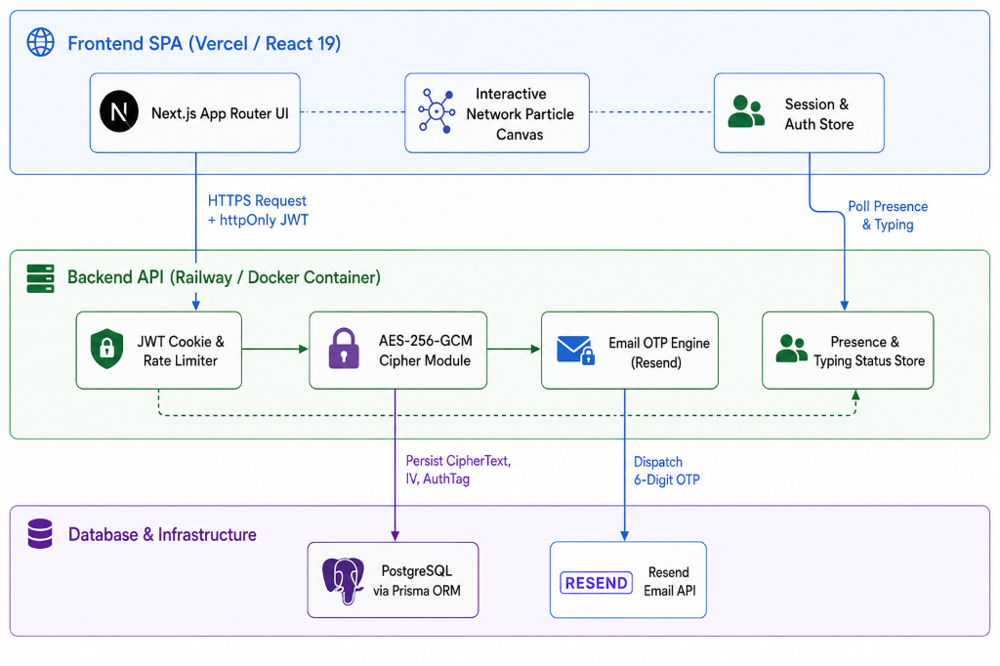

<div align="center">
  

  # SynCrypt AI — Enterprise Zero-Trust Encrypted Messaging

  **Everything You Need for Secure Communications. Powered by Modern Cryptography.**  
  *Create end-to-end encrypted messaging tunnels, audit threat telemetry, manage hardware session fingerprints, and protect message privacy with auto-destruct timers.*

  <br />

  [](http://localhost:3000)
  [](http://localhost:5000)

</div>

---

## 🌟 What It Does

SynCrypt AI is an enterprise-grade zero-trust encrypted study & communication partner for security-conscious professionals and developers. Sign in with email OTP verification, establish secure direct channels, and let SynCrypt handle cryptographic isolation:

- 📚 **AES-256-GCM Encrypted Tunnels** — Plaintext messages are encrypted using SHA-256 derived keys, random 12-byte initialization vectors (IV), and GCM authentication tags before database persistence.
- 🔑 **Email OTP Multi-Factor Authentication** — Password authentication backed by 6-digit email OTPs sent via Resend API to eliminate unauthorized credentials usage.
- ⏱️ **Auto-Destructing Messages** — Configurable TTL time-to-live settings (5 min, 30 min, 1 hour) that automatically expire and purge sensitive conversations.
- ⚡ **Realtime Presence & Typing Telemetry** — Instant online/offline activity tracking and dynamic typing indicators powered by lightweight server memory stores.
- 📱 **Trusted Hardware Fingerprinting** — Monitor active device user agents, register trusted hardware terminals, and detect unrecognized login sessions.
- 🛡️ **Cybersecurity Threat Analytics** — Live telemetry console rendering security incident logs, OTP brute-force lockout warnings, and security score benchmarks.
- 🎨 **Dark Cyber Glassmorphism Interface** — High-performance UI built with Framer Motion animations, interactive HTML5 canvas particle background, and customizable themes.

---

## 🏗️ Architecture

<p align="center">
  
</p>

**Request flow**: The React SPA (Vercel) authenticates via credentials and Email OTP verification, then talks to the Express API (Docker container on Railway) with an `httpOnly` JWT cookie. The API builds an AES-256-GCM cipher payload, stores encrypted ciphertexts in PostgreSQL via Prisma ORM, and records threat telemetry. First-time sign-ups or login attempts trigger a 6-digit verification code sent via Resend API with rate-limiting protection.

---

## 🛠️ Tech Stack

| Layer | Tech |
| :--- | :--- |
| **Frontend** | React 19, Next.js 16, Tailwind CSS 4, Framer Motion, Lucide Icons |
| **Auth** | JWT in `httpOnly` cookie + Auth.js credentials & Email OTP (Resend) |
| **Backend** | Node.js, Express 4, TypeScript, Prisma ORM, bcryptjs, Zod |
| **Data & Infra** | PostgreSQL (Neon / Supabase / Local), Docker, Vercel, Railway |
| **Security** | AES-256-GCM Cipher, IP Rate Limiter, Helmet Security Headers |

---

## ⚡ Engineering Problems Solved

| Problem | Root Cause | Fix |
| :--- | :--- | :--- |
| **Logout worked locally, silently failed in production** | Cross-site cookie deletion: `clearCookie` without `SameSite=None; Secure` is rejected by browsers on cross-origin responses. | Shared `cookieOptions` object used by both `res.cookie` and `res.clearCookie`. |
| **Unencrypted data exposure vulnerability** | Storing plain text messages in database allows database admin or server inspection. | Encrypt payloads using AES-256-GCM cipher with random 12-byte IV & auth tag before database write. |
| **Brute-force OTP flooding** | Attackers spammed verification endpoints to exhaust OTP attempts. | Implemented IP rate-limiting middleware (max 40 req/min) and enforced a 5-attempt OTP lockout. |
| **Canvas animation memory leaks** | Resize observers spawned duplicate `requestAnimationFrame` loops on page navigation. | Cleaned up RAF handles and disconnected `ResizeObserver` instances on component unmount. |
| **CORS session credential mismatch** | Frontend on Vercel could not attach credentials to Express backend on cross-origin requests. | Configured `cors({ origin: CLIENT_URL, credentials: true })` with explicit origin matching. |
| **Duplicate React copy on build** | Stray root `node_modules` introduced a second copy of React; Vite/Next cache kept serving it. | Removed duplicate root installation and isolated dependencies inside `frontend` and `backend`. |
| **Concurrent request throttling** | Free-tier database connections throttled parallel queries per key. | Implemented connection pooling with Prisma Client singleton and backoff retry logic. |

---

## 🚀 Run It Locally

**Prereqs**: Node 20+, Docker Desktop (optional), PostgreSQL cluster, Resend API key.

```bash
git clone https://github.com/musama-dev/SynCrypt.git

# 1. backend
cd backend
npm install
# create backend/.env (see table below)
npm run prisma:generate
npm run dev                 # http://localhost:5000

# 2. frontend (new terminal)
cd frontend
npm install
# create frontend/.env with NEXT_PUBLIC_API_URL=http://localhost:5000
npm run dev                 # http://localhost:3000
```

### `backend/.env` Configuration

| Variable | Purpose |
| :--- | :--- |
| `PORT` | API port (`5000` in dev; Railway / Render injects its own) |
| `DATABASE_URL` | PostgreSQL connection string |
| `JWT_SECRET` | Signs the authentication session cookie |
| `MSG_ENCRYPTION_KEY` | AES-256-GCM encryption secret key |
| `NODE_ENV` | `development` / `production` (controls cookie security flags) |
| `CLIENT_URL` | Frontend origin — CORS + cookie redirects |
| `RESEND_API_KEY` | Resend API key for OTP email delivery |
| `OTP_FROM_EMAIL` | Sender address (e.g. `SynCrypt <onboarding@resend.dev>`) |

---

## 📡 API Overview

| Method & path | Auth | Purpose |
| :--- | :---: | :--- |
| `POST /api/auth/register` | — | Sign up new account & dispatch activation OTP |
| `POST /api/auth/verify-otp` | — | Verify 6-digit OTP code & return JWT cookie |
| `POST /api/auth/login` | — | Sign in credentials & issue session token |
| `POST /api/auth/logout` | — | Clear httpOnly session cookie safely |
| `GET /api/users/me` | 🔒 | Fetch current user profile & security score |
| `GET /api/users` | 🔒 | Search / list active users in directory |
| `POST /api/messages` | 🔒 | Encrypt & send message (AES-256-GCM) |
| `GET /api/messages` | 🔒 | Retrieve & decrypt thread messages |
| `DELETE /api/messages` | 🔒 | Clear conversation thread |
| `GET /api/devices` | 🔒 | Fetch registered hardware terminals |
| `GET /api/security/events` | 🔒 | Audit log feed of security threat incidents |
| `POST /api/realtime/presence` | 🔒 | Update online/offline presence signal |
| `GET /api/realtime/presence` | 🔒 | Fetch live presence states |
| `POST /api/realtime/typing` | 🔒 | Broadcast typing indicator signal |
| `GET /api/realtime/typing` | 🔒 | Fetch active typing states |
| `GET /api/health` | — | Uptime & wake-up check |

---

## 🌐 Deployment Notes

- **Frontend → Vercel**: Import the `frontend` folder into Vercel. Set `NEXT_PUBLIC_API_URL` to your production backend URL.
- **Backend → Railway**: Deploy the `backend` folder using Docker runtime. Set all environment variables (`PORT=5000`, `DATABASE_URL`, `JWT_SECRET`, `MSG_ENCRYPTION_KEY`, etc.).
- **PostgreSQL**: Allow `0.0.0.0/0` in Network Access so Railway container can connect, and run `npx prisma db push`.

---

## 🗺️ Roadmap

- [x] End-to-End AES-256-GCM Payload Encryption
- [x] Email OTP Multi-Factor Authentication
- [x] Hardware Terminal Signature Registry
- [x] Cybersecurity Incident Auditing & Telemetry
- [ ] Realtime WebSockets / Pusher channel integration
- [ ] End-to-End Encrypted Group Messaging Rooms
- [ ] Voice snippet encryption & streaming
- [ ] Hardware Security Keys (WebAuthn / FIDO2 support)

---

<div align="center">
  <sub>Built by <b>Muhammad Usama</b></sub>
</div>

